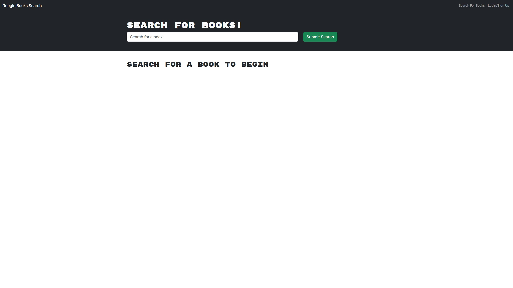
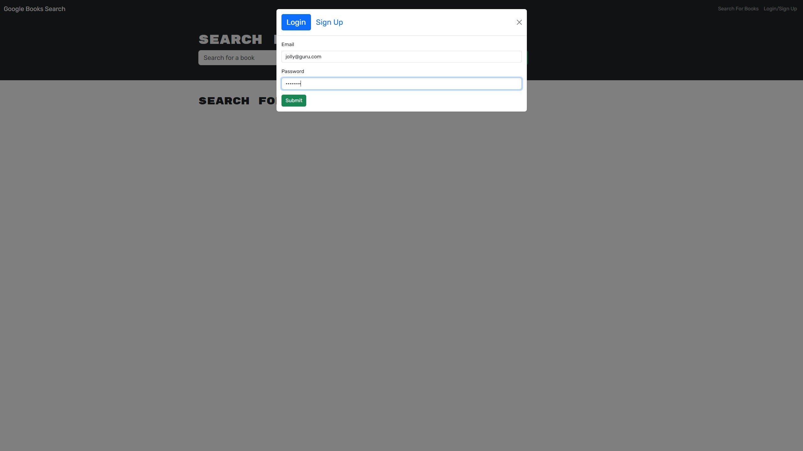
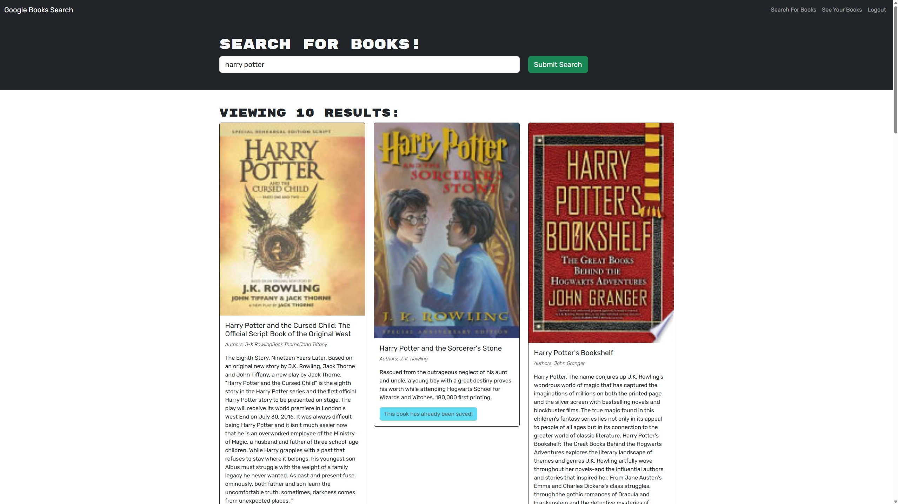
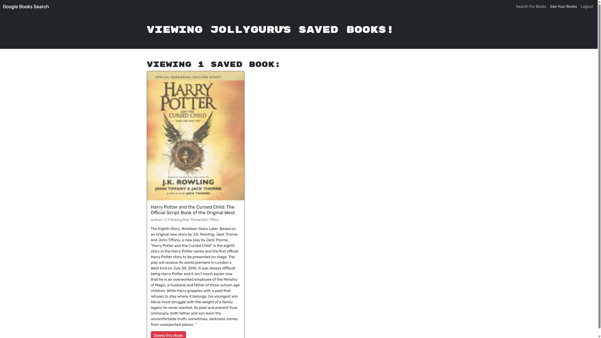

  # book-search   
  
  ## Description 

  This book search application allows a user to save books to read later.

  ## Table of Contents

  - [Installation](#installation)
  - [Usage](#usage)
  - [License](#license)
  - [Dev](#dev)

  ## Installation

  Clone down the repo. Open root folder in terminal, install packages, and run the following commands:

  1. npm run build
  2. npm run seed
  3. npm run server

  Keep this terminal running and open a new terminal from the root folder, run the following command:

  4. npm run client:dev

  ## Usage

  Login using jolly@guru.com & password, or create a new user. Browse the books using the searchbar and view saved books using the links in the navbar in the header.

  ### Mock-Up
  
  
  
  

  ## License
  This application is covered under the [MIT](https://opensource.org/licenses/MIT) license.
  

  ## Dev

  Try the deployed [application](https://book-search-moku.onrender.com/).

  Check out the [repo](https://github.com/michaelhdavies/book-search).

  Developed by [Michael Henry Davies](https://github.com/michaelhdavies/).

  [Back to Top](#description)
  
  